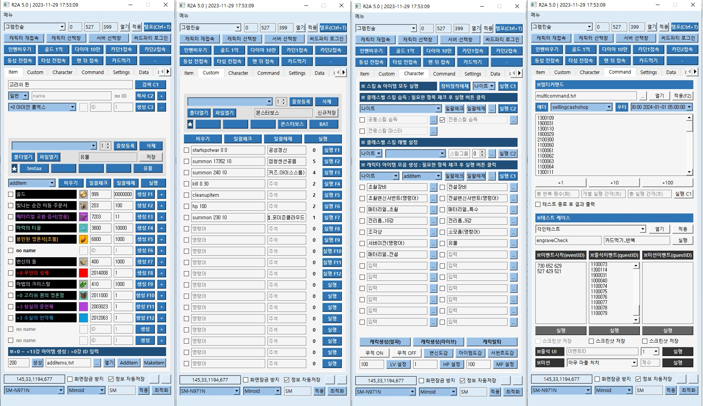

## 테스트 자동화 툴 프로젝트 (R2M)



### 목차

1. [**소개**](#1-소개)
2. [**설치**](#2-설치)
3. [**사용법**](#3-사용법)
4. [**기능**](#4-기능)

---

### 1. 소개

1. **단위/통합 테스트 준비 자동화 기능 개발**

    ```bash
    테스트 공수량 분석을 통해 자동화 대상 선정
    로그 자동 수집 및 빌드와 배포 
    자동화를 통한 신속한 유지 보수
    Pyqt5 GUI 개발로 툴 사용 접근성 강화
    명령어 자동 사용 관련 8개 기능 개발
    문서 파일 연동 관련 6개 기능 개발
    사용자 커스터마이징 기능(프리셋)
    ```

2. **단순 반복 업무 자동화 기능 개발**

    ```bash
    UI 자동화 테스트 개발(Pyautogui, Tesseract)
    웹 결제/JIRA 관련 단순 반복 업무 자동화 개발(Selenium)
    10여 개의 확률 컨텐츠 인게임 검증 자동화 개발
    테스트 결과 문서 자동화 기능 개발
    ```

---

### 2. 설치

1. **공통**:

    ```bash
    # 프로젝트 클론
    git clone https://github.com/SungMinseok/R2A
    ```
    
    ```bash
    # 가상환경 생성 (python == 3.9.4)
    python -m venv r2a
    ```
2. **외부망**:
    ```bash
    # 의존성 설치
    cd R2A
    pip install -r requirements.txt
    ```
    
3. **내부망**:
    ```bash
    # 의존성 다운로드 (외부망)
    cd R2A
    pip download -d pkg -r requirements.txt

    # 가상환경 생성 (내부망)
    d:\venv>python -m venv r2a
    d:\venv>cd r2a
    d:\venv\r2a>Scripts\activate.bat
    
    # 의존성 설치 (내부망)
    (r2a) d:\venv\r2a>pip install --no-index --find-links=d:\pkg -r d:\r2a\requirements.txt
    ```

---

### 3. 사용법

1. **개발PC**:

    ```bash
    python Execute.py
    ```

2. **원본PC**:

    ```bash
    python R2A.py
    ```

---

### 4. 기능

1. **단위/통합 테스트 준비 자동화(pyautogui)**:

    ```bash
    캐릭터 텔레포트
    0강~13강 장비 생성
    명령어 모음 실행
    다수의 아이템 생성
    클래스별 최고 스펙 세팅
    아이템/명령어 프리셋 기능
    멀티 커맨드 기능
    ```

2. **단위 테스트 자동화(pyautogui, tesseract, selenium)**:

    ```bash
    다수의 장비 분해 테스트
    레벨별 스탯 데이터 테스트
    장비 데이터 테스트
    장비 강화 설정 테스트
    인앱/웹 결제 테스트
    아이템 정보 확인 테스트
    장비 각인 증폭제 능력치 확인 테스트
    ```
    
3. **인게임 확률 검증 자동화(pyautogui, tesseract)**:

    ```bash
    장비 각인 확률 검증
    아이템 드랍 확률 검증
    상자류 뽑기 확률 검증 테스트
    변신/서번트 뽑기 확률 검증 테스트
    영혼 부여 확률 검증 테스트
    스킬 강화 확률 검증 테스트
    슬롯 강화 확률 검증 테스트
    ```
    
4. **그 외 보조 기능**:

    ```bash
    엑셀 데이터 연동 및 검색 기능
    스크린샷 텍스트 추출 기능
    스크린샷 텍스트 번역 기능
    툴 정보 캐시화
    툴 에러 로그 자동 수집 기능
    최신 문서 검색 기능
    툴 자동 업데이트 기능
    ```
